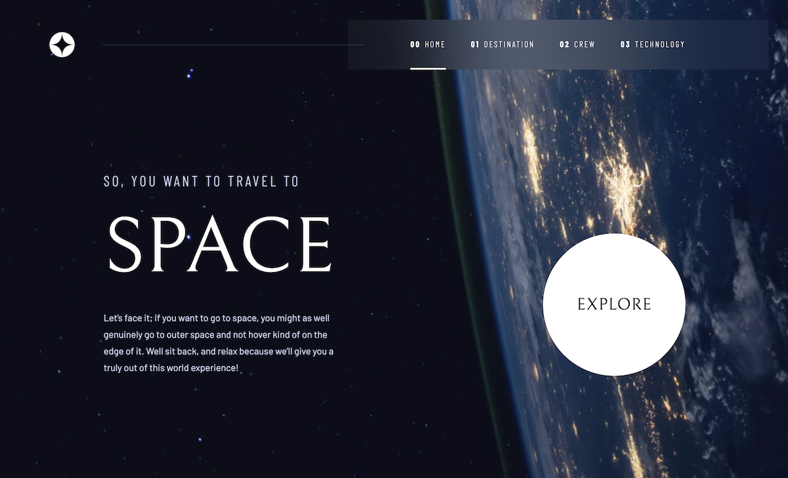
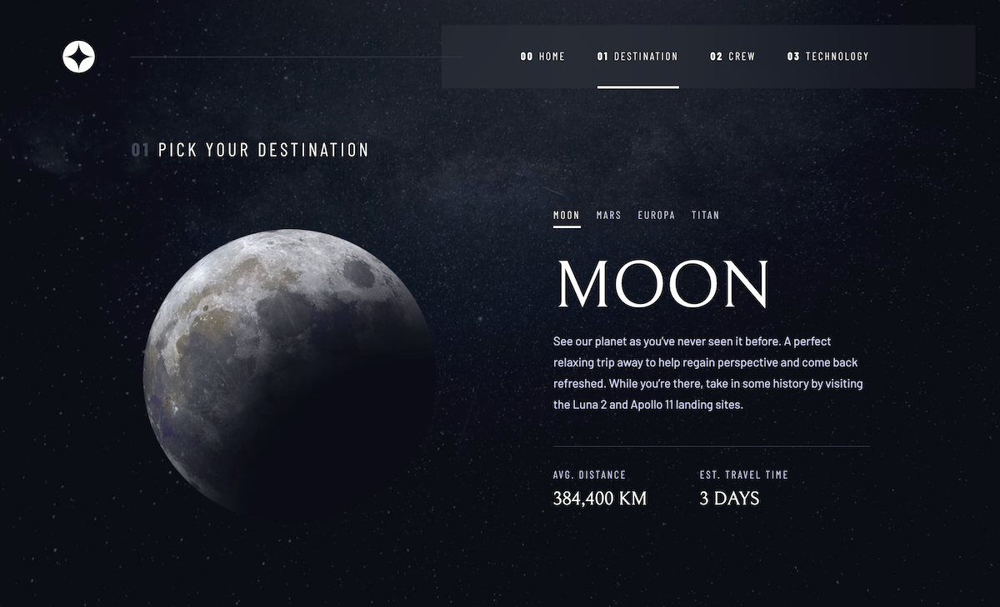
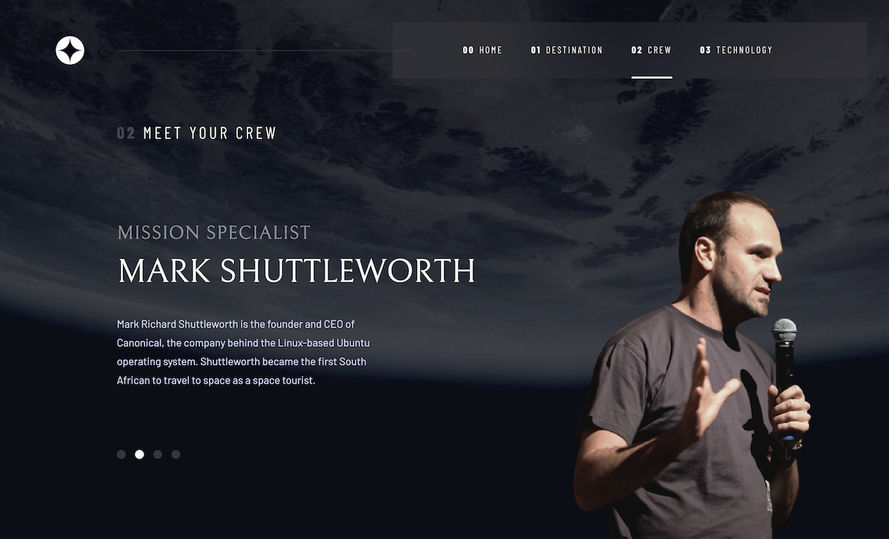
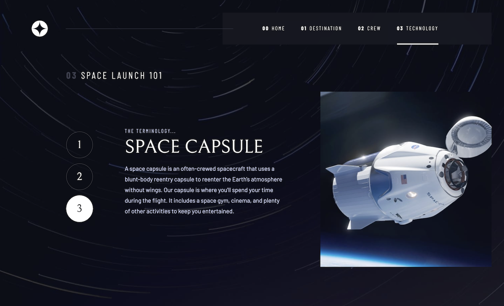

# Frontend Mentor - Space tourism website solution

This is a solution to the [Space tourism website challenge on Frontend Mentor](https://www.frontendmentor.io/challenges/space-tourism-multipage-website-gRWj1URZ3). Frontend Mentor challenges help you improve your coding skills by building realistic projects.

## Table of contents

-   [Overview](#overview)
    -   [The challenge](#the-challenge)
    -   [Screenshot](#screenshot)
    -   [Links](#links)
-   [My process](#my-process)
    -   [Built with](#built-with)
    -   [What I learned](#what-i-learned)
    -   [Continued development](#continued-development)
    -   [Useful resources](#useful-resources)
-   [Author](#author)
-   [Acknowledgments](#acknowledgments)

## Overview

### The challenge

Users should be able to:

-   View the optimal layout for each of the website's pages depending on their device's screen size
-   See hover states for all interactive elements on the page
-   View each page and be able to toggle between the tabs to see new information

### Screenshot

### Links

-   Solution URL: [source code on GitHub](https://github.com/JT1974/space-tourism)
-   Live Site URL: [you can try it here](https://jt1974.github.io/space-tourism/)

## My process

### Built with

	
	
	
	
	
	
	
	

-   Semantic HTML5 markup
-   CSS custom properties
-   SASS
-   Flexbox
-   CSS Grid
-   Mobile-first workflow
-   [React](https://reactjs.org/) - JS library
-   [React Router](https://reactjs.org/) - Routing library for React
-   [Styled Components](https://styled-components.com/) - For styles

### What I learned

#### Lesson #1

Always start with HTML and CSS. Never go directly to Styled Components, at least not for bigger projects. Small component styling is ok though.

#### Lesson #2

Before jumping into the project, decide carefully about the best layout tool, because a bad decision can lead to a huge amount of extra work to refactor the CSS code and even the HTML/JSX.
Look at how components are behaving in the different views, and decide how to best scale the content (or not), between the fixed views (based on the Figma design). I spent a lot of time scaling the images, but they looked so ugly (web optimized), that I finally decided to fix their sizes to the given image size. As this is not defined in the challenge docs, I guess it's ok.

### Continued development

Further refactoring and simplification is needed, because the component styling became to complex, and full of redundant, or unnecessary code, that I didn't want to waste time to do.

### Useful resources

-   [React Router documentation](https://reactrouter.com/docs/en/v6/getting-started/overview)
-   [W3C Markup Validator](https://validator.w3.org/)

## Author

-   Website - [Janos Takacs](https://github.com/JT1974)
-   Frontend Mentor - [@JT1974](https://www.frontendmentor.io/profile/JT1974)
-   Twitter - [@TakacsJanos7](https://twitter.com/TakacsJanos7)

